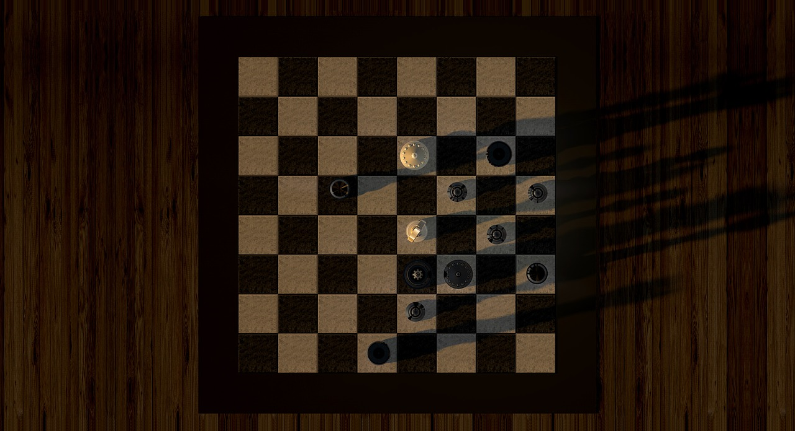

# Простые типы данных — byte, short, int, long, в примерах — введение в Java 002

Чтобы вызвать на экран что-то большее, чем "Привет, Мир!", надо работать с числами, символами и буквами. Чтобы работать с ними в Java — надо научиться их хранить и передавать. Для этого нам надо познакомиться с понятием "типы данных", а точнее **"простые типы данных"**.

## Простые типы данных — Java Primitives

Существуют следующие базовые типы данных:
byte, short, int, long, float, double, char, boolean и String (не совсем примитив, но базовый тип данных).

### Целочисленные типы данных

Мы начнём знакомство с базовыми типами данных с **int**.

С помощью целочисленного типа данных, а именно так и переводится "integer", мы храним в **int** целые числа. Для визуализации можно попробовать представить себе следующие примеры:

+ Общепринятая нумерация домов во всем мире использует целые числа: ул. Грибоедова 15, ул. Каштановая 10, пятое Авеню 457 и т.д.
+ Перекличка в классе тоже возможна с помощью типа данных **int** — первый, второй, третий, четвёртый...
+ Числа Фибоначчи: 0, 1, 1, 2, 3, 5, 8, 13, 21, 34, 55...
+ Возведение одного простого числа в степень другого простого числа — например 2 в степени 7 = 128.

Давайте совершим пару арифметических действий на практике.

```Java
public class HalloInteger {
    public static void main(String[] args) {
        // Создаём переменные и присваиваем им значения
        int a = 2;
        int b = 3;
        int c = a + b;
        System.out.println("Сумма a и b = " + c);
        // Найдём периметр квадрата.
        int d = 4;
        System.out.println("Периметр квадрата со стороной d => P = " + 4 * d);
    }
}
```

В Java есть несколько типов данных для хранения целых чисел, это — byte, short, int, long. Принципиально они различаются только размером. Для хранения числа в "int" надо 4 байта, если же речь идёт о таблице Менделеева или о простых задачах, то мы можем обойтись и примитивным типом данных "byte". Именно столько занимает места этот тип данных, 1 байт (byte) или 8 бит. Давайте посмотрим таблицу:

|Тип |Размер (бит) |Диапазон |
|:----|:----|:----|
|byte |8 бит |от -128 до 127 |
|short |16 бит |от -32768 до 32767 |
|int |32 бит |от -2147483648 до 2147483647 |
|long |64 бит |от -9223372036854775808 до 9223372036854775807 |

2 в восьмой степени = 256. Именно столько можно запомнить в примитивном типе данных переменных **byte**. От **-128 до 127** мы можем работать с любым числом в десятичной системе, включая ноль.

```Java
public class HalloLong {
	public static void main(String[] args) {
		long a = 7_456_678_678L;
		long b = 87_456_678_678L;
		long c = a + b;
		System.out.println(c);
	}
}
```

Нам надо помнить только, что byte — это 8 бит, short — 16 бит, int — 32 бита, long — 64 бита.
Обычно возникают 2 вопроса. Какой тип данных использовать и зачем эти 4 типа "одинаковых" данных?

Разные типы данных сложились исторически. Из за особенностей x86-процессоров. Всё, что нам надо помнить — это экономия: размер ячейки для хранения, мы экономим место, процессорное время, RAM компьютера или прибора пользователя, и на планете не умирают котики.

Если постоянно всё писать просто в long, то наша программа будет занимать неоправданно много места, она будет "есть" память и доставлять неудобства. И действительно, зачем использовать программу в 8 гигабайт, если можно сделать её, как минимум, в восемь раз меньше?

Ещё раз для закрепления:

```Java
public class IntegerTypes {
    public static void main(String[] args) {
        byte a = 111;
        short b = 1111;
        int c = 7777777;
        long d = 2_358_765_649l;
        // Постфикс l или L обозначает литералы типа long.
        // L нужна только за границами int.
        // В Java можно использовать подчёркивания для визуального разделения чисел.
        // 2_358_765_649 = 2358765649, для программы разницы нет.
        System.out.println(a);
        System.out.println(b);
        System.out.println(c);
        System.out.println(d);
    }
}
```

Пример использования byte:

```Java
public class AdditionByte {
    public static void main(String[] args) {
        byte a = 10;
        byte b = 30;    
        byte c = (byte) (a + b);
        System.out.println("The c variable Value after Addition is : " + c);
    }
}
```

Если сложить два **byte** числа, которые в сумме дают больше 127, например 70 и 80, то мы получим не 150, а отрицательное число.
Byte пойдёт в минусовые значения и будет считать дальше от **-128**. По кругу, в своём диапазоне из 256 возможных значений. Мир типа данных Byte — всего лишь один байт. Это его ограничение.

## Определение, объявление, инициализация переменных

### Definition, declaration, initialization

В Java переменная определяется и объявляется одновременно:

```code
short b;
```

Отделить эти понятия нельзя. Обычно в Java говорят только о *декларации* переменной, когда она просто объявляется:

>"Слушайте все!!! И не говорите, что не слышали! Мы объявляем, что от сего дня создана переменная B типа шорт".

В момент, когда мы присваиваем переменной значение, мы говорим *об инициализации* переменной.

>"Отныне переменная B получает графство и значение" 3.

```code
b = 3;
```

### Двоичные числа и не только 

Java позволяет хранить не только десятичные числа

```code
    int hexValue1 = 0x100; // Шестнадцатеричная система счисления
    int binar = 0B1001_1001; // Двоичная система счисления
    int octal =  0757;  // восьмеричная система счисления
```

## Домашнее задание

Найдите применение каждому типу данных из заголовка и напишите программу с использованием byte, short, int, long:

1. Найти площадь и периметр квадрата
2. Найти площадь и периметр прямоугольника
3. Найти площадь и периметр куба
4. Найти количество зёрен на шахматной доске, если на первую клетку положить одно зёрнышко, на вторую клетку два зёрнышка, на третью в два раза больше, чем на предыдущей, то есть четыре и так далее.



## Дополнительные материалы

+ https://docs.oracle.com/javase/tutorial/java/nutsandbolts/datatypes.html
+ Легенда о [шахматах и зёрнах](https://ru.wikipedia.org/wiki/%D0%97%D0%B0%D0%B4%D0%B0%D1%87%D0%B0_%D0%BE_%D0%B7%D1%91%D1%80%D0%BD%D0%B0%D1%85_%D0%BD%D0%B0_%D1%88%D0%B0%D1%85%D0%BC%D0%B0%D1%82%D0%BD%D0%BE%D0%B9_%D0%B4%D0%BE%D1%81%D0%BA%D0%B5)
