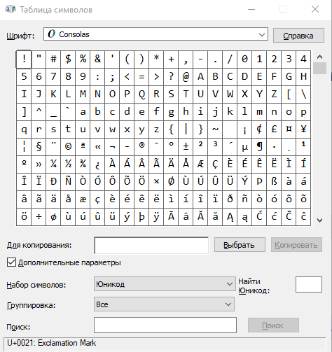
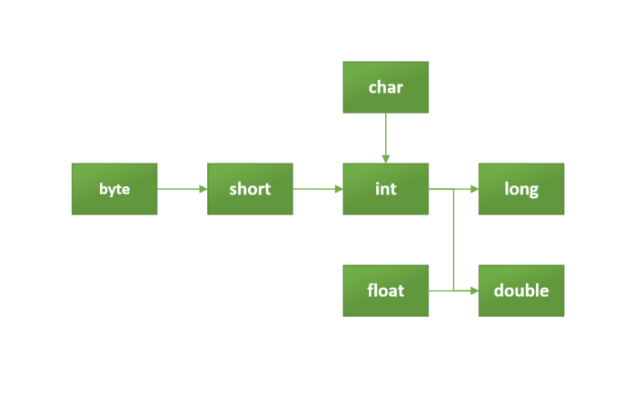

# Типы данных char и String: примеры применения — введение в Java 004

## Char



Если в программе нужны символы, то для этого мы пользуемся типом данных **char**. Например:

```Java
public class HelloChar {
    public static void main(String[] args) {
 
         char zahl = 100;
        // Сотый по счёту символ в таблице
        char octal = '\u039A';
        // Вызов определённого символа кодом
        char zeichen = 'A';
        // Буква A
        char tabulator = '\t'; // В русском языке клавиша называется "Таб"
        // Табулятор
        char phi = '\u03A6';
        // Греческая буквая Фита - PHI
 
        System.out.println(zahl);
        System.out.println(octal);
        System.out.println(zeichen);
        System.out.print(tabulator);
        System.out.println(phi);
    }
}
```

Объект базового (примитивного) типа **char** является 16-битным символом Unicode.

Мы можем вывести любое сообщение или любой символ. однако достаточно сложно вывести на экран кавычки, ведь в них мы и держим значения наших переменных. Для таких случаев мы используем **экранирование**. С помощью обратной косой черты(обратный слеш) мы экранируем символ или используем её для дополнительных параметров.

```code
\b  Backspace (Курсор двигается на одно место влево)
\n  Newline (Новая строчка)
\f  Newpage (Новая страница)
\r  Carriage return (Курсор становится на первое место в строчке, возврат каретки)
\t  Горизонтальный табулятор
\"  Двойная кавычка
\'  Одинарная кавычка
\\  Backslash(вызов обратного слэша)
\___  Символы с октальным значением от 000 до 377, например \304 соответствует символу Ä
\u___  Вызов символа уникода (Unicode-16). Где например \u00C4 соответствует Ä
```

Таблица символов Windows (charmap) вызывает и показывает именно те символы, которые можно вызвать в Java.

## String

Мы можем хранить в программе и набор символов: пароль, фамилию, звание, название улицы или просто набор символов. Для хранения таких данных можно использовать **String**. Пример использования:

```Java
public class HelloString {
    public static void main(String[] args) {
        String firstname = "Andrej";
        String secondname = "Podlubnyj";
        char copyright = '\u00A9';
        int old = 18;
        System.out.println(firstname + " " + secondname + " " + old);
        String student = firstname + " " + secondname + " " +  copyright;
        System.out.println(student);
    }
}
```

Один символ можно записать как "маленьким" стрингом, так и через символ при помощи типа данных char. Цепочку символов, больше одного, мы храним в типе данных String. Каждый элемент этой цепочки символов можно отобразить при помощи char. Это очень важно понять и запомнить.

Строковый набор символов класса String может немного больше, чем просто хранить строчку в переменной. Например, мы можем вычислить количество символов или длину String, используя один из методов, которые есть в Java. Это примерно такие же методы, как те, что мы использовали в предыдущих уроках, чтобы возводить числа в степень или выводить результаты на экран:

```code
        int dlina;
        dlina = student.length();
        System.out.println(dlina);
```

Для переменных типа String ява заготовила много дополнительных методов, которые делают нашу жизнь проще. Например метод **substring**, который вырезает из одной цепочки символов другую. 

Например:

```Java
public class WhatCanYouDoString {
	public static void main(String[] args) {
		String name = "AndrejPodlubnyj";
		int dlina = name.length();
		System.out.println(name);
		System.out.println(dlina);

        // вырезать символы с 6-го по 15-ый
		String firstName = name.substring(6,15);  
        
		dlina = firstName.length();
		System.out.println(firstName);
		System.out.println(dlina);
	}
}
```

Если мы пишем приложение для веб-сайта с "user generated content", то мы можем столкнуться с тем, что часть контента пишется заглавными буквами. В Java есть методы, которые приводят цепочку символов алфавита к прописным (заглавным) или к строчным (маленьким) буквам. Давайте рассмотрим пример:

```Java
public class UppercaseAndLowercase {
	public static void main(String[] args) {
		String articleTitle = "london is the capital";
		articleTitle = articleTitle.substring(0,1).toUpperCase() + articleTitle.substring(1);
		System.out.println(articleTitle);

		articleTitle = articleTitle.toUpperCase();
		System.out.println(articleTitle);

		System.out.println(articleTitle.toLowerCase());
	}
}
```

С помощью метода toUpperCase() мы делаем буквы прописными, с помощью метода toLowerCase() мы приводим значение строки к строчным буквам.

Мы обязательно вернёмся к этому и другим возможностям класса. Пока надо только запомнить, что, если мы хотим создать записную книжку, то фамилию и имя абонента мы скорее всего будем хранить с помощью типа данных String.

## Явные и неявные преобразования

Значения, передаваемые переменным, можно привести в тот тип данных, которые переменная может принять. Вручную или автоматически, или явно и неявно.



**Расширение типа (widening Casting)**, которое можно проследить на схеме с помощью стрелок,  происходит автоматически. Это преобразование меньшего типа данных в типа большего размера:  byte -> short -> char -> int -> long -> float -> double.

**Сужение типа (narrowing Casting)** — преобразование типа данных большего размера в тип данных меньшего размера — делается вручную: double -> float -> long -> int -> char -> short -> byte

```Java
public class MyClass {
  public static void main(String[] args) {
    int myInt = 9;
    double myDouble = myInt; // Automatic casting: int to double

    System.out.println(myInt);      // Outputs 9
    System.out.println(myDouble);   // Outputs 9.0
  }
}
```

```Java
public class MyClass {
  public static void main(String[] args) {
    double myDouble = 9.78;
    int myInt = (int) myDouble; // Manual casting: double to int

    System.out.println(myDouble);   // Outputs 9.78
    System.out.println(myInt);      // Outputs 9
  }
}
```

Допустим, у нас имеется старая база данных, где все данные записаны в строковом виде. Например просто текстовый файл столбиком. Java даёт нам возможность "спарсить" целочисленные данные из строк.

```code
String number = "10";
int result = Integer.parseInt(number);
System.out.println(result);
```

## Дополнительные материалы

1. По [ссылке](https://docs.oracle.com/javase/8/docs/api/java/lang/String.html) можно посмотреть все методы, которые поддерживает тип данных String.
2. Сервисы "быстрая ссылка" и онлайн-компиляторы:
  - https://www.tutorialspoint.com/compile_java_online.php
  - https://ideone.com/ytQajk
  - https://www.browxy.com/
    
## Домашнее задание

1. Найти в интернете таблицы для типа данных char. Проверить, что они действительно соответствуют тому, что выводит Java на экран. Найти "смешные" символы, символ стандартного смайлика, найти символ телефона, параграфа, копирайта(C), торговой марки(тм), рубля, евро, доллара, знаков зодиака, шахмат, червы.
2. Вбить в поисковую строку Windows "charmap".
3. Найдите самостоятельно статьи на тему:
    - Что такое юникод?
    - Что такое ASCII?
    - Что такое UTF? 
4. Что будет, если сложить переменную String с самой собой? Можно ли умножить её на саму себя? Почему?
5. Вывести на экран сообщение в кавычках. Например собственное имя + "профессия".
6. Вывести на экран построчно анкетные данные: Имя, Фамилия, Адрес, Улица и тд и тп. Пример вывода одной строчки:

           - Имя пользователя: Андрей   
6. Вырезать из выражения "Вход разрешён" последние 8 символов и добавить "воспрещён".
7. Вывести на экран "Осторожно, вход воспрещён" заглавными буквами.
