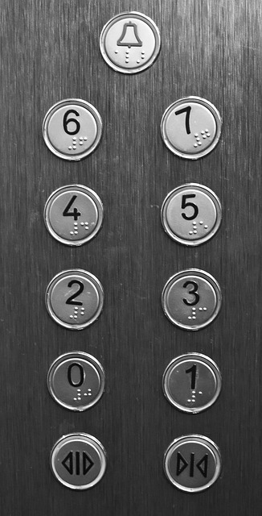

# Switch и case: оператор выбора — введение в Java 006

**Оператор выбора** - Switch и **опции выбора** Case.
Пример:

+ За пятёрку в четверти по математике папа мне обещал велосипед.
+ За четвёрку в четверти по математике мама купит мне GoPro4.
+ За тройку меня наверное не будут ругать.
+ За двойку меня отругают.
+ За единицу меня "убьют".


Типичный жизненный пример, который можно написать на Java:

```Java
public class SwitchOne {
    public static void main(String[] args) {

        int оценкаВЧетверти = 1;
        String награда;

        switch (оценкаВЧетверти) {
            case 5:
                награда = "Велосипед";
                break;
            case 4:
                награда = "GoPro4";
                break;
            case 3:
                награда = "Награды не будет";
                break;
            case 2:
                награда = "Потерянный час времени и плохое настроение";
                break;
            case 1:
                награда = "По грибам";
                break;
            default:
                награда = "Такой оценки не существует";
                break;
        }
        System.out.println(награда);
    }
}
```

Мы видим, что каждая оценка заканчивается брейком: Если брейк не ставить, то выбор селектирует следующую награду. Удобно, если у нас одинаковый результат на несколько переменных. Заканчивается ввод данных дефаултным выбором, который выдаётся при получение непредусмотренных данных или лучше сказать всех остальных неуказанных.

При наличии множественных выборов удобно использовать switch и case. Направо пойдёшь коня потеряешь, прямо.... Это именно тот случай где уже можно использовать такой алгоритм действий.

Первый же пример из поиска приведёт нас к календарю. Это наиболее используемый пример в учебниках. 12 месяцев с уникальным названием и ID:

```Java
public class SwitchDemoCalendar {
    public static void main(String[] args) {
 
        int month = 8;
        String monthString;
        switch (month) {
            case 1:  monthString = "January";
                     break;
            case 2:  monthString = "February";
                     break;
            case 3:  monthString = "March";
                     break;
            case 4:  monthString = "April";
                     break;
            case 5:  monthString = "May";
                     break;
            case 6:  monthString = "June";
                     break;
            case 7:  monthString = "July";
                     break;
            case 8:  monthString = "August";
                     break;
            case 9:  monthString = "September";
                     break;
            case 10: monthString = "October";
                     break;
            case 11: monthString = "November";
                     break;
            case 12: monthString = "December";
                     break;
            default: monthString = "Invalid month";
                     break;
        }
        System.out.println(monthString);
    }
}
```

В итоге работы данной конструкции мы получаем переменную с нужным значением. В последнем случае "monthString", или в случае с оценкой "награда". Абсолютно простая конструкция, где самое сложное синтаксис, который просто надо выучить. И после написания 30 различных примеров без шпаргалок он в крови.

Для закрепления рассмотрим ещё пример:

```Java
public class SwitchCoffee {
	public static void main(String[] args) {
		int a = 1; //номер кнопки в кофеавтоамте
		switch (a) {
			case 1:
				System.out.println("Кофе американо готовится");
				break;
			case 2:
				System.out.println("Кипяток сейчас будет");
				break;
			case 3:
				System.out.println("Кофе эспресо готовится");
				break;
			case 4:
				System.out.println("Какао-какао уже в пути");
				break;
			case 5:
				System.out.println("Вода кипятится");
				System.out.println("Кофе молется");
				System.out.println("Сливки добавляются");
				break;
			default:
				System.out.println("повторите свой выбор, напиток под номером: "
                 + a + " Временно недоступен");
                break;
		}
		System.out.println("Программа отработана без ошибок");
	}
}
```

Можно заметить, что в пятом кейсе последнего примера с кофеавтоматом запускается множество сообщений. Мы можем использовать один кейс для запуска нескольких директив. Но это не рекомендуется, плохая читаемость кода. Обычно Switch используется для изменения одной переменной. Но это не значит, что вы такого не встретите в чужом коде.

Перед домашним заданием хочется привести ещё один пример с обычным лифтом в многоэтажном здании. В зависимости от номера нажимаемой кнопки у нас лифт едет(ожидаемо) на нужный этаж. Оператор выбора Switch используется вокруг вас везде.  



## Дополнительные материалы

https://docs.oracle.com/javase/tutorial/java/nutsandbolts/switch.html

## Домашнее задание

1. Напишите программу действий кассира магазина. Если у него пытаются купить алкоголь следующие 5 покупателей:
10 лет, 17 лет, 18 лет, 20 лет и 30 лет.
2. Напишите программу, которая определяет сезон года. Месяца указаны int переменными.
