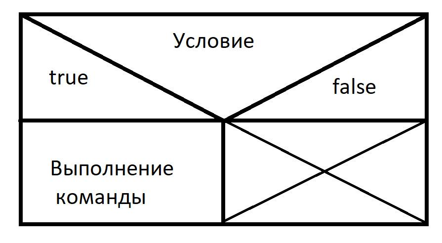

# Условный оператор if, if-else введение в Java 007



В прошлом уроке я рассматривал оператор выбора Switch. Оператор IF имеют схожие функции и примерно те же цели. Основные отличия в используемых условиях. Кстати, как обычно, мне не обязательно верить и спросить у гугли например java switch vs if сравнение. Только на хабре я нашёл несколько статей рассматривающие эстетическую сторона вопроса, вопрос скорости, эффективности и вопрос используемых методов.

Поездка в летний лагерь:
Если от родителей будет разрешение (true), то я поеду в летний лагерь.
Иначе я останусь на всё лето дома.

```code
if (true){
    System.out.println("я поеду в летний лагерь");
}
else {
System.out.println("я останусь на всё лето дома");
}
```

Switch нет смысла использовать с булевыми значениями. Всего-то два варианта. И это одно из отличий if-else к switch

Сразу про плюсы:
If-Else позволяет запускать несколько(больше) одной команд.

```Java
public class IfElseKosmo {
    public static void main(String[] args) {
        int a = 5;
        final int SUPERCONSTANT_G = 10;
        // модификатор final обозначает константность переменной, которую невозможно изменить.
        // например ускорение свободного падения на поверхности Земли или
        // PI, которое всегда константо. Кроме этой особенности final на результаты вычесления
        // не влияет
        if (a < SUPERCONSTANT_G){
            System.out.println("Первоночальное ускорение недостаточно");
            System.out.println("Ракета не может стартовать");
            System.out.println("Подготовить аварийные службы");
        }
        else {
            System.out.println("Ракета улетает в космос");
            System.out.println("Выпустить прессрелиз об успешном запуске");
            System.out.println("Подготовить программистов к государственным наградам");
        }
    }
}
```

В предыдущем уроке был очень жизненный урок про кассира, алкоголь и несовершеннолетних. В Switch нельзя указать "младше 18". А в if else можно:

```Java
public class AlkogolIfElse {
    public static void main(String[] args) {
        int возрастПокупателя =40;
        if (возрастПокупателя < 16){
            System.out.println("Алкоголь и сигареты продавать нельзя!!!");
        }
        else if (возрастПокупателя >=18){
            System.out.println("Можно продавать алкоголь и сигареты");
        }
        else {
            System.out.println("Водку продавать ещё нельзя, а пиво и сигареты уже можно");
        }
    }
}
```

Переменные кириллическими буквами набраны в учебных целях и что бы показать, что такое может пройти. Считается плохим и очень плохим тоном использовать не ASCI символы в переменных.

Иногда программисты печально шутят, что вся жизнь кодера состоит из написания различных if else и Switch команд. Отчасти так и есть. В фундаменте Java не так много команд. И одну из самых часто употребляемых вы только что изучили.


## Дополнительные матриалы

1. The if-then and if-then-else Statements - https://docs.oracle.com/javase/tutorial/java/nutsandbolts/if.html

## Домашнее задание

1. Напишите программу действий для сотрудника дорожной полиции, который остановил машину.
    + При езде до 50км/час нарушений нет;
    + за езду от 50км/час до 65км/час устное порицание и лекция на 5 минут;
    + за превышение скорости от 16км/час - 40 евро штрафа;
    + за езду от 100км/час до 130км/час - штраф 500 евро;
    + и за езду свыше 130км/час - штраф в 1000 евро, забирание прав + на 3 года и конфискация транспортного средства.
2. Напишите программу, которая объяснит наступление определённых событий в зависимости от выбора витязя.
3. Напишите программу для машины на светофоре. Что делать если горит красный, жёлтый или зелёный свет.
4. Метод вывода даты на экран монитора принимает 3 целочисленных значения(день, месяц, год) и разделитель (например "-"). Проверить значения данных на адекватность, и если надо дописать нули.  
       - 5.6.2020 должно быть выведено на экран как "05-06-2020"
       - 50.40.2020 не должно быть выведено вообще
5. Реализовать программу “конвертер валют”
   Реализовать метод, который принимает название валюты (например, “EUR”,”RUR”,”USD”,”GPB”) и выдает курс к доллару. Естественно, “USD” возвращает 1.0 .
   Используя метод из предыдущего пункта написать метод, который принимает пару валют (“GPB”,”EUR”) и возвращает курс обмена.
   Используя метод из предыдущего пункта реализовать метод который получает пару валют и сумму в первой валюте, возвращает сумму во второй валюте.
